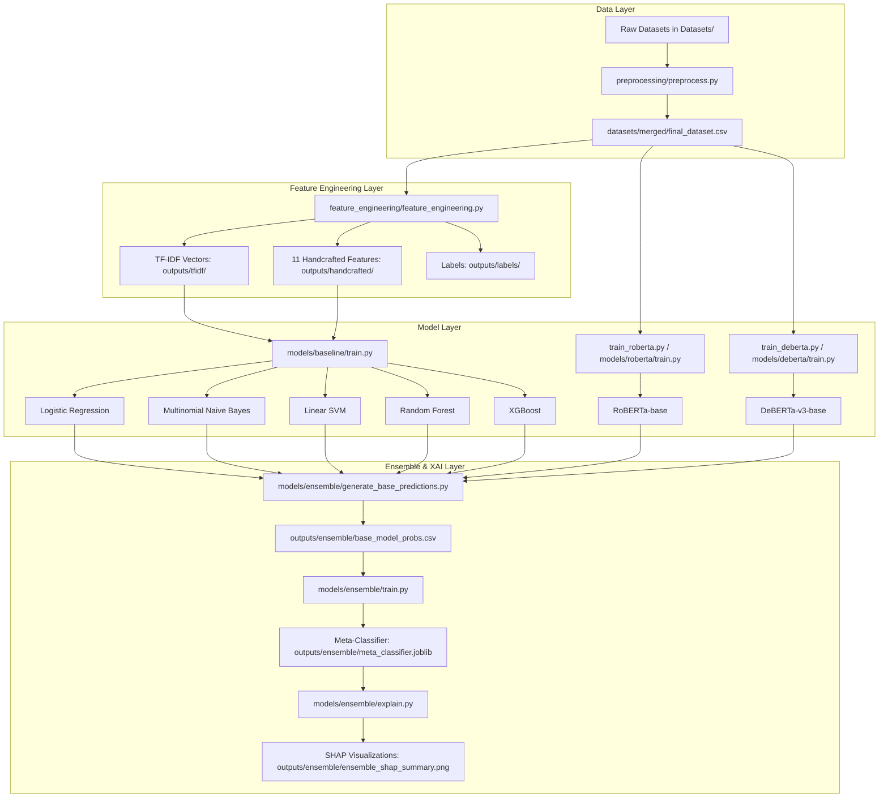
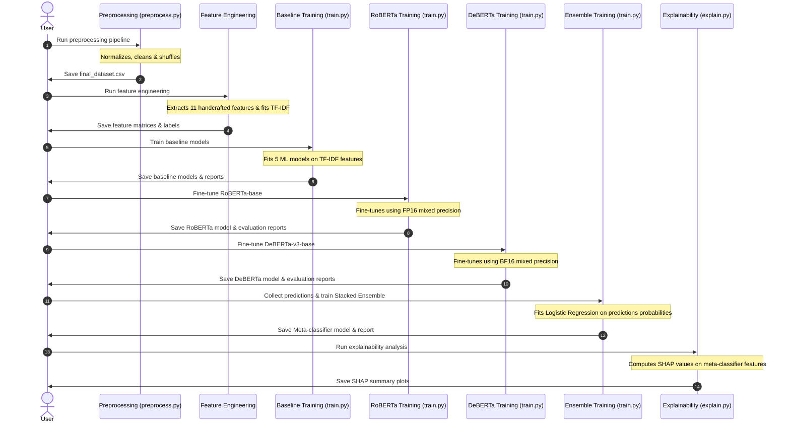

# Study Document: AI-Generated Text Detection Using Transformers

This document provides a comprehensive technical audit and analysis of the repository for the **Hybrid Explainable Transformer Framework for Detecting AI-Generated Academic Text**.

---

## Status Mapping Keys
*   ✅ **Implemented**: Code is present and actively executed in the runtime pipeline.
*   ⚠ **Configured but unused**: Code is implemented and structured, but is not imported or executed by any active pipeline entry point.
*   📝 **Planned/Referenced only**: Mentioned in configuration comments, markdown files, or import schemas but lacks implementation or execution path.

---

## 1. Project Overview

### Objective
To build and evaluate a hybrid machine learning and deep learning framework for detecting whether a given text document is human-written or generated by an artificial intelligence (e.g., GPT-4, ChatGPT, Claude).

### Problem Statement
With the rapid progression of Large Language Models (LLMs), distinguishing human academic writing from machine-generated content has become difficult. This project addresses the need for high-accuracy, robust, and explainable models to detect AI-generated academic text.

### Scope
- **Baselines**: Classical machine learning models utilizing term frequency-inverse document frequency (TF-IDF) features.
- **Transformers**: Fine-tuned state-of-the-art transformer models (RoBERTa-base, DeBERTa-v3-base).
- **Hybrid Ensemble**: Stacking base model probabilities with a meta-classifier.
- **Explainability**: SHAP value interpretation on the ensemble model to explain predictions.

### Applications
Academic integrity verification, automated grading auditing, and identification of machine-generated web/scientific content.

### Inputs/Outputs
- **Input**: Raw text documents (`.txt` files, JSON, CSV files containing text entries).
- **Output**: Binary classification (`0` for Human Written, `1` for AI Generated) along with probability scores and prediction explainability.

### Workflow Summary
1.  **Preprocessing**: Clean and normalize text datasets.
2.  **Feature Extraction**: Generate TF-IDF vectors (50,000 features) and extract 11 handcrafted linguistic features.
3.  **Baseline Training**: Train five classical ML classifiers.
4.  **Transformer Training**: Fine-tune RoBERTa and DeBERTa-v3 models under VRAM constraints.
5.  **Ensemble Stacking**: Combine prediction probabilities via a meta-classifier.
6.  **Explainability**: Apply SHAP to analyze the relative influence of individual models.

---

## 2. Project Architecture

### Mermaid Architecture Diagram



### End-to-End Pipeline Stages

1.  **Data Ingestion & Preprocessing**: Discovers and normalizes inputs from heterogeneous files, cleans text formatting, drops null/empty rows, filters short documents (<20 words), and outputs a shuffled `final_dataset.csv`.
2.  **Feature Engineering**: Splitting data stratified (70% train / 10% val / 20% test). Fits TF-IDF vectorizer (max 50,000 features) on train split and transforms all splits. Extracts 11 handcrafted statistical and linguistic features.
3.  **Baseline Model Tier**: Fits 5 classifiers on TF-IDF features. Evaluates them and saves outputs in `outputs/models/` and reports in `outputs/reports/`.
4.  **Transformer Tier**: Fine-tunes `roberta-base` and `microsoft/deberta-v3-base` using Hugging Face's trainer. RoBERTa-base uses standard FP16 mixed precision. DeBERTa-v3-base uses BF16 mixed precision to prevent gradient underflow.
5.  **Ensemble Stacking**: Collects predictions/probabilities from all baseline and transformer classifiers. Fits a Logistic Regression meta-classifier on validation set probabilities and evaluates it on test set probabilities.
6.  **Explainable AI (XAI)**: Uses SHAP LinearExplainer to compute SHAP values for the ensemble, outputting feature importance plots showing how much weight each base model holds in the final prediction.

---

## 3. Repository Structure

```
-AI-Generated-Text-Detection-Using-Transformers_CODE/
|-- Datasets/                      # Folder containing raw dataset directories and the merged CSV output
|   `-- merged/
|       |-- final_dataset.csv      # Unified processed CSV (55,829 rows)
|       `-- final_dataset.csv.bak  # Backup file
|-- data_loader/                   # Data ingestion and custom PyTorch dataset packaging [⚠ Configured but unused]
|   |-- dataset.py                 # Custom Dataset class wrapping Pandas DataFrames for PyTorch [⚠ Unused]
|   |-- loader.py                  # Traverses directory trees to read txt files [⚠ Unused]
|   `-- utils.py                   # Logger setup and helper functions [⚠ Unused]
|-- datasets/                      # Subfolder containing intermediate datasets [✅ Implemented]
|-- feature_engineering/           # Feature extraction pipeline modules [✅ Implemented]
|   |-- __init__.py                # Module initialization
|   |-- config.py                  # Max features, split, and path configurations
|   |-- feature_engineering.py     # Orchestrator for tokenization, splitting, and extraction
|   |-- feature_report.md          # Log report summarizing feature extraction
|   |-- preprocessing.py           # TextPreprocessor class using basic regex tokenization
|   |-- utils.py                   # Concurrent-based handcrafted feature extraction functions
|   `-- vectorizer.py              # Wrapper for TfidfVectorizer and matrix persistence
|-- models/                        # Baseline, transformer, and ensemble script directories [✅ Implemented]
|   |-- baseline/                  # Classical ML training, evaluation, and inference
|   |   |-- evaluate.py            # ModelEvaluator generates reports and matplotlib figures
|   |   |-- inference.py           # Interface for loading models and classifying new text
|   |   `-- train.py               # Classical ML model training orchestrator
|   |-- deberta/                   # DeBERTa-v3 pipeline
|   |   |-- compare.py             # Script to compare model architectures
|   |   |-- config.py              # DeBERTa-v3 training hyperparameters configuration
|   |   |-- dataset.py             # CSV loading, validation, and tokenization utilities
|   |   |-- evaluate.py            # Evaluation helper routines
|   |   |-- inference.py           # Evaluation/Inference routines
|   |   |-- model.py               # Model loading helper (HuggingFace API)
|   |   |-- report.py              # Performance markdown generator
|   |   |-- train.py               # Execution entry point
|   |   |-- trainer.py             # Customized Trainer instantiator
|   |   |-- utils.py               # Shared utility functions
|   |   `-- visualize.py           # Plotting curves (loss, confusion matrix, ROC/PR)
|   |-- ensemble/                  # Ensemble stacking scripts
|   |   |-- explain.py             # SHAP-based feature importance explainability
|   |   |-- generate_base_predictions.py # Computes predictions for baselines and transformers
|   |   `-- train.py               # Trains Logistic Regression meta-classifier
|   |-- feature_engineering/       # Pickled train/test feature matrices [✅ Implemented]
|   `-- roberta/                   # RoBERTa-base training pipeline (mirrors deberta/ structure)
|-- outputs/                       # Holds all generated model checkpoints, graphs, and classification reports [✅ Implemented]
|-- preprocessing/                 # Preprocessing module for raw text ingestion [✅ Implemented]
|   `-- preprocess.py              # Ingests, cleans, and merges raw texts
|-- reports/                       # EDA and individual model report output directories [✅ Implemented]
|-- Optimization_Plan.md           # Documentation listing potential future optimizations [✅ Implemented]
|-- Project.md                     # General project overview [✅ Implemented]
|-- clean_dataset.py               # Removes duplicates, null text, and updates final_dataset.csv [✅ Implemented]
|-- dataset_audit.py               # Audit script validating size and label distribution of final_dataset.csv [✅ Implemented]
|-- eda.py                         # Complete Exploratory Data Analysis execution script [✅ Implemented]
|-- patch_roberta.py               # Quick utility file [✅ Implemented]
|-- preprocessing_report.md        # Automatically generated summary of dataset merge/clean phase [✅ Implemented]
|-- replace_dataset.py             # Atomically updates dataset on disk [✅ Implemented]
|-- requirements.txt               # PIP environment requirements [✅ Implemented]
|-- save_clean_dataset.py          # Save wrapper for clean dataset script [✅ Implemented]
|-- smoke_test.py                  # Short run validation script for components [✅ Implemented]
|-- train_deberta.py               # Alternate root entry point for training DeBERTa [✅ Implemented]
`-- train_roberta.py               # Alternate root entry point for training RoBERTa [✅ Implemented]
```

---

## 4. Technology Stack

- **Python (v3.12)**: Base programming language.
- **PyTorch (v2.0+)**: Deep learning framework used for fine-tuning transformers.
- **Hugging Face (Transformers, Datasets, Accelerate)**: Used for loading pre-trained models (`roberta-base`, `deberta-v3-base`), processing tokenized datasets, and managing training loops.
- **Scikit-Learn**: Used for TF-IDF vectorization, baseline model architectures (Logistic Regression, Naive Bayes, SVM, Random Forest), evaluation metrics, and stratified splitting.
- **XGBoost**: Gradient boosted decision tree library for baseline comparison. Uses GPU histogram method (`tree_method='hist'`) if CUDA is available.
- **SHAP (Shapley Additive exPlanations)**: Library for explainable AI. Analyzes input probabilities to show how models contribute to meta-classifier decisions.
- **Joblib**: Used for model persistence (`.joblib` format) of baseline classifiers and the meta-ensemble classifier.
- **Pandas & NumPy**: Data processing and matrix operations.
- **Matplotlib, Seaborn, & Plotly**: Visualization libraries for producing reports, loss curves, confusion matrices, ROC/PR curves, and interactive comparison plots.

---

## 5. Dataset

### Location
The raw dataset files are stored under `Datasets/` directory. The final processed, cleaned, and merged dataset is saved in CSV format at `Datasets/merged/final_dataset.csv`.

### Schema
The processed dataset contains two primary fields:
- `text` (string): Preprocessed text content.
- `label` (integer): Binary classification label (`0` = Human Written, `1` = AI Generated).

### Labels
- `0`: Human-written documents.
- `1`: AI-generated documents (e.g. GPT-3.5, GPT-4, Claude).

### Size
The dataset contains **55,829** total samples after deduplication and cleaning:
- Human Written (0): 32,168 samples (57.6%)
- AI Generated (1): 23,661 samples (42.4%)

### Splits
- **Feature Engineering & Baselines**: Stratified split of 70% Train, 10% Validation, and 20% Test.
  - Train: 39,080 samples
  - Validation: 5,583 samples
  - Test: 11,166 samples
- **Transformers (RoBERTa & DeBERTa)**: Stratified split of 80% Train, 10% Validation, and 10% Test.
  - Train: 44,663 samples
  - Validation: 5,583 samples
  - Test: 5,583 samples

### Preprocessing & Cleaning
Handled by `preprocessing/preprocess.py` and `clean_dataset.py`:
- Null byte removal (`\x00` stripped).
- Whitespace normalization (newlines and tabs replaced with standard spaces).
- Discarding of short texts (fewer than 20 words).
- Deduplication: Drops exact duplicate entries (`text` + `label`) and resolves cross-label duplicate text (keeping first occurrence).

### Tokenization
- **Classical Models**: TF-IDF unigram and bigram representation.
- **RoBERTa-base**: RoBERTa BPE-based tokenizer with a vocab size of 50,265. Maximum length is capped at 256 tokens, padded and truncated.
- **DeBERTa-v3-base**: SentencePiece tokenizer with a vocab size of 128,000. Maximum length is capped at 256 tokens, padded and truncated.

---

## 6. Data Pipeline

1.  **Ingestion**: `preprocessing/preprocess.py` searches `Datasets/` recursively for CSV, TSV, JSON, JSONL, and `.txt` directory trees, converting labels into canonical integers (`0` and `1`).
2.  **Cleaning**: `clean_dataset.py` filters empty values, collapses extra white spaces, applies a 20-word minimum threshold, and performs duplicate purging.
3.  **Splitting**: Data is split using `train_test_split` with stratification to preserve class balance across train, validation, and test sets.
4.  **TF-IDF Extraction**: `feature_engineering/vectorizer.py` converts cleaned texts to lowercase and builds character-level or word-level TF-IDF sparse matrices.
5.  **Transformer Dataloaders**: HuggingFace `Dataset.from_pandas` wraps data splits. A tokenization map runs over batches (batch size 1000) using `AutoTokenizer` and formats tensors for PyTorch.

---

## 7. Feature Engineering

### 1. Word-level TF-IDF Representation (1-2 N-grams)
- **Description**: Term Frequency-Inverse Document Frequency matrix mapping term significance. Capped at 50,000 max features.
- **Purpose**: Captures word occurrence patterns and lexical choices.
- **Advantages**: Captures text domain features without deep learning overhead.
- **Limitations**: Ignores word ordering, context, and syntax.
- **Alternatives**: Word2Vec, GloVe, FastText embeddings.

### 2. Handcrafted Linguistic and Statistical Features (11 Features)
Extracted in parallel via `feature_engineering/utils.py`:
- **Word count**: Total whitespace-delimited words.
- **Character count**: Total characters including spaces.
- **Sentence count**: Total sentences using `[.!?]+` boundaries.
- **Average word length**: Characters per word.
- **Average sentence length**: Words per sentence.
- **Vocabulary size**: Count of unique words.
- **Lexical diversity**: Vocabulary size / word count ratio.
- **Stopword ratio**: Stopwords count / word count.
- **Punctuation ratio**: Punctuation characters / total character count.
- **Digit ratio**: Numeric characters / total character count.
- **Uppercase ratio**: Capital letters / total character count.

- **Purpose**: Profiles writing style differences (human variety vs. structured LLM output).
- **Advantages**: Explainable, lightweight, and robust to semantic drift.
- **Limitations**: High variance; easily bypassed by prompting styles.
- **Alternatives**: POS-tag distributions, readability scores (Flesch-Kincaid).

---

## 8. Machine Learning Models

Five classical classifiers are trained on the TF-IDF feature matrix (`max_features=50,000`):

1.  **Logistic Regression**
    *   *Working Principle*: Fits a linear decision boundary using the sigmoid function to map log-odds to binary probabilities.
    *   *Hyperparameters*: `C=1.0`, solver: SAGA, max_iter: 100, random_state: 42.
    *   *Usage*: baseline classification.
    *   *Complexity*: Training: $O(N \cdot D)$, Inference: $O(D)$ where $N$ is samples and $D$ is feature size.
2.  **Multinomial Naive Bayes**
    *   *Working Principle*: Probabilistic model applying Bayes' Theorem under the assumption of conditional independence between features.
    *   *Hyperparameters*: `alpha=0.1` (Laplace smoothing).
    *   *Usage*: Fast text classification baseline.
    *   *Complexity*: Training: $O(N \cdot D)$, Inference: $O(D)$.
3.  **Linear Support Vector Machine (SVM)**
    *   *Working Principle*: Finds the hyperplane that maximizes the margin between classes. Wrapped in `CalibratedClassifierCV` (sigmoid calibration) to output probabilities.
    *   *Hyperparameters*: `C=1.0`, loss: hinge, calibration: cross-validation.
    *   *Usage*: Baseline classification.
    *   *Complexity*: Training: $O(N^2 \cdot D)$ to $O(N^3 \cdot D)$, Inference: $O(D_{support\_vectors})$.
4.  **Random Forest**
    *   *Working Principle*: Ensemble of decision trees trained with bootstrap aggregation (bagging) and random feature selection.
    *   *Hyperparameters*: `n_estimators=100`, max_depth=None, n_jobs=-1, random_state=42.
    *   *Usage*: Non-linear baseline classification.
    *   *Complexity*: Training: $O(M \cdot N_{samples} \log(N_{samples}) \cdot \sqrt{D})$, Inference: $O(M \cdot d_{tree})$ where $M$ is tree count.
5.  **XGBoost (Extreme Gradient Boosting)**
    *   *Working Principle*: Gradient-boosted decision trees optimizing a regularized objective function using a second-order Taylor expansion.
    *   *Hyperparameters*: `n_estimators=100`, max_depth=6, learning_rate=0.1, tree_method="hist", device="cuda" (if available).
    *   *Usage*: Gradient boosted decision baseline.
    *   *Complexity*: Training: $O(M \cdot D \cdot N \log(N))$, Inference: $O(M \cdot d_{tree})$.

---

## 9. Transformer Models

Two transformer architectures are fine-tuned on the dataset:

1.  **RoBERTa-base (`roberta-base`)**
    *   *Architecture*: 12-layer, 768-hidden, 12-heads, 125M parameters. Bidirectional encoder pre-trained on dynamic masking.
    *   *Tokenizer*: Byte-Pair Encoding (BPE), vocab size of 50,265.
    *   *Fine-Tuning Strategy*: Classification head added on top of the `[CLS]` token. Trained using AdamW with FP16 mixed precision.
    *   *VRAM Requirements*: ~3.2 GB with batch size of 8.
2.  **DeBERTa-v3-base (`microsoft/deberta-v3-base`)**
    *   *Architecture*: 12-layer, 768-hidden, 12-heads, 184M parameters. Incorporates disentangled attention and relative position embeddings.
    *   *Tokenizer*: SentencePiece, vocab size of 128,000.
    *   *Fine-Tuning Strategy*: Custom Trainer using AdamW with BF16 mixed precision to avoid gradient underflow.
    *   *VRAM Requirements*: ~2.8 GB with batch size of 4 and gradient accumulation steps of 4.

---

## 10. Ensemble Learning

### Architecture
A stacked generalization ensemble is implemented in `models/ensemble/train.py`:
- **Base Models**: Logistic Regression, Multinomial Naive Bayes, Linear SVM, Random Forest, XGBoost, RoBERTa-base, and DeBERTa-v3-base.
- **Meta-Classifier**: Logistic Regression (`sklearn.linear_model.LogisticRegression`).

### Prediction Fusion & Stacking
1.  Base classifiers output predictions on validation and test samples.
2.  A probability dataframe is constructed: `[lr_prob, nb_prob, svm_prob, rf_prob, xgb_prob, roberta_prob, deberta_prob, label]`.
3.  The meta-classifier is trained on these probability features to learn optimal blending weights, then tested on the test split.

- **Benefits**: Combines statistical patterns from TF-IDF models with contextual embeddings from transformers.
- **Limitations**: High inference pipeline latency; dependent on base model stability (e.g. DeBERTa's performance collapse).

---

## 11. Explainable AI

### SHAP (Shapley Additive exPlanations)
- **Purpose**: Computes game-theoretic Shapley values to identify the contribution of each base model's probability score to the final ensemble prediction.
- **Usage**: Implemented in `models/ensemble/explain.py`. Loads `meta_classifier.joblib` and `base_model_probs.csv` and applies `shap.LinearExplainer` to plot importance.
- **Interpretation**: Features (base models) with positive SHAP values push the ensemble decision towards predicting AI-generated (1), while negative SHAP values pull it towards human-written (0).
- **Advantages**: Provides model-agnostic feature attribution.
- **Limitations**: Only analyzes the meta-classifier input probabilities, not the raw text token attributions.

---

## 12. Training Pipeline

### Pipeline Flow
1.  **Dataset Loading**: Loads `final_dataset.csv`, cleans rows, and splits into train/validation/test sets.
2.  **Dataloader Initialization**: Tokenizes datasets and groups them in PyTorch dataloaders with `pin_memory=True` and `num_workers=0` (prevents Windows CUDA deadlocks).
3.  **Optimizer**: Fused AdamW (`adamw_torch_fused`) updates model parameters.
4.  **Scheduler**: Linear learning rate scheduler with 10% warmup steps.
5.  **Loss Function**: Cross-Entropy Loss (`nn.CrossEntropyLoss`).
6.  **Trainer**: HuggingFace `Trainer` handles training loop, evaluation steps, and early stopping.
7.  **Checkpointing**: Saves checkpoints at the end of each epoch, retaining only the single best checkpoint.
8.  **Logging**: Validation metrics printed and logged to file every 200 steps.
9.  **Evaluation**: Computes accuracy, precision, recall, F1, and ROC-AUC on the validation set.
10. **Saving**: Exports the fine-tuned model and tokenizers to `outputs/roberta/` or `outputs/deberta/`.

---

## 13. Algorithms

| Algorithm | Purpose | File | Complexity | Notes |
| :--- | :--- | :--- | :--- | :--- |
| **TF-IDF Vectorization** | Feature Generation | [vectorizer.py](file:///c:/7th%20Sem/Paper/-AI-Generated-Text-Detection-Using-Transformers_CODE/feature_engineering/vectorizer.py) | $O(N \cdot L_{avg})$ | Tokenizes and scales term counts |
| **Handcrafted Extractor** | Statistical profiling | [utils.py](file:///c:/7th%20Sem/Paper/-AI-Generated-Text-Detection-Using-Transformers_CODE/feature_engineering/utils.py) | $O(N \cdot L_{avg})$ | Runs in parallel using concurrent processes |
| **Logistic Regression** | Linear base model & Meta-ensemble | [train.py](file:///c:/7th%20Sem/Paper/-AI-Generated-Text-Detection-Using-Transformers_CODE/models/baseline/train.py) | $O(N \cdot D)$ | Fits quickly on TF-IDF features |
| **Multinomial NB** | Classical baseline | [train.py](file:///c:/7th%20Sem/Paper/-AI-Generated-Text-Detection-Using-Transformers_CODE/models/baseline/train.py) | $O(N \cdot D)$ | Extremely fast training profile |
| **Linear SVM** | Classical baseline | [train.py](file:///c:/7th%20Sem/Paper/-AI-Generated-Text-Detection-Using-Transformers_CODE/models/baseline/train.py) | $O(N^2 \cdot D)$ | Probability output calibrated using CV |
| **Random Forest** | Non-linear tree baseline | [train.py](file:///c:/7th%20Sem/Paper/-AI-Generated-Text-Detection-Using-Transformers_CODE/models/baseline/train.py) | $O(M \cdot N \log N \cdot \sqrt{D})$ | High precision, lower recall |
| **XGBoost** | Gradient boosted baseline | [train.py](file:///c:/7th%20Sem/Paper/-AI-Generated-Text-Detection-Using-Transformers_CODE/models/baseline/train.py) | $O(M \cdot D \cdot N \log N)$ | Slowest classical training runtime |
| **RoBERTa-base** | Deep sequence classification | [train_roberta.py](file:///c:/7th%20Sem/Paper/-AI-Generated-Text-Detection-Using-Transformers_CODE/train_roberta.py) | $O(N_{steps} \cdot L^2)$ | Dynamic masking transformer |
| **DeBERTa-v3-base** | Deep sequence classification | [train_deberta.py](file:///c:/7th%20Sem/Paper/-AI-Generated-Text-Detection-Using-Transformers_CODE/train_deberta.py) | $O(N_{steps} \cdot L^2)$ | Disentangled attention mechanism |
| **SHAP Linear Explainer** | Ensemble Explainability | [explain.py](file:///c:/7th%20Sem/Paper/-AI-Generated-Text-Detection-Using-Transformers_CODE/models/ensemble/explain.py) | $O(N \cdot M)$ | Computes additive feature attributions |

---

## 14. Hyperparameters

| Parameter | Value | File | Purpose |
| :--- | :--- | :--- | :--- |
| **max_features** | 50,000 | [config.py](file:///c:/7th%20Sem/Paper/-AI-Generated-Text-Detection-Using-Transformers_CODE/feature_engineering/config.py) | Capping TF-IDF vocabulary size |
| **ngram_range** | (1, 2) | [config.py](file:///c:/7th%20Sem/Paper/-AI-Generated-Text-Detection-Using-Transformers_CODE/feature_engineering/config.py) | Unigrams and bigrams extraction |
| **test_size** | 0.20 (Baselines) / 0.10 (Transformers) | [config.py](file:///c:/7th%20Sem/Paper/-AI-Generated-Text-Detection-Using-Transformers_CODE/feature_engineering/config.py) | Held-out evaluation fraction |
| **learning_rate** | 2e-5 (Transformers) | [config.py](file:///c:/7th%20Sem/Paper/-AI-Generated-Text-Detection-Using-Transformers_CODE/models/roberta/config.py) | Fine-tuning optimizer rate |
| **batch_size** | 8 (RoBERTa) / 4 (DeBERTa) | [config.py](file:///c:/7th%20Sem/Paper/-AI-Generated-Text-Detection-Using-Transformers_CODE/models/roberta/config.py) | VRAM protection micro-batch size |
| **gradient_accumulation_steps** | 2 (RoBERTa) / 4 (DeBERTa) | [config.py](file:///c:/7th%20Sem/Paper/-AI-Generated-Text-Detection-Using-Transformers_CODE/models/deberta/config.py) | Accumulates steps for effective batch size of 16 |
| **weight_decay** | 0.01 | [config.py](file:///c:/7th%20Sem/Paper/-AI-Generated-Text-Detection-Using-Transformers_CODE/models/roberta/config.py) | L2 regularization value |
| **warmup_ratio** | 0.1 | [config.py](file:///c:/7th%20Sem/Paper/-AI-Generated-Text-Detection-Using-Transformers_CODE/models/roberta/config.py) | Warmup steps ratio for learning rate scheduler |
| **early_stopping_patience** | 2 | [config.py](file:///c:/7th%20Sem/Paper/-AI-Generated-Text-Detection-Using-Transformers_CODE/models/roberta/config.py) | Epochs to wait before stopping training |

---

## 15. Evaluation

The following table summarizes the performance metrics extracted from saved reports:

| Model | Test Accuracy | Precision | Recall | F1 Score | ROC-AUC | Training Time | Inference Speed |
| :--- | :---: | :---: | :---: | :---: | :---: | :---: | :---: |
| **Logistic Regression** | 93.68% | 92.67% | 92.39% | 92.53% | 98.90% | 4.92s | 0.008s (total) |
| **Multinomial NB** | 92.95% | 91.91% | 91.42% | 91.66% | 98.54% | 0.11s | 0.029s (total) |
| **Linear SVM** | 94.16% | 93.33% | 92.86% | 93.09% | 99.02% | 7.58s | 0.062s (total) |
| **Random Forest** | 89.83% | 97.77% | 77.77% | 86.63% | 98.00% | 2.81s | 0.165s (total) |
| **XGBoost** | 92.42% | 90.92% | 91.21% | 91.06% | 98.47% | 225.75s | 0.485s (total) |
| **RoBERTa-base** | 94.79% | 96.13% | 91.38% | 93.69% | 99.26% | 25h 37m | 121.3 samples/sec |
| **DeBERTa-v3-base** | 57.62% | 0.00% | 0.00% | 0.00% | 50.00% | 14h 23m | 52.2 samples/sec |

*Note: The fine-tuned DeBERTa-v3 model training run collapsed to predicting only class 0 (majority label), resulting in 0% precision, recall, and F1 on the test set.*

---

## 16. Hardware Optimization

- **CUDA Acceleration**: Enabled for XGBoost training and PyTorch-based transformers.
- **Mixed Precision**:
  - RoBERTa: FP16 (`fp16=True`) mixed precision.
  - DeBERTa-v3: BF16 (`bf16=True`) mixed precision, resolving positional embedding gradient crashes.
- **Gradient Accumulation**: Simulated larger batch sizes (16) while training with physical batch sizes of 4 or 8 to fit within 4GB VRAM.
- **Workers**: Set to 0 (`num_workers=0`) to avoid multiprocessing deadlocks on Windows environments.
- **Pin Memory**: Enabled (`pin_memory=True`) in the transformer configurations to speed up CPU-to-GPU data transfers.
- **Memory Optimization**: `save_total_limit=1` reduces disk writes, and fused AdamW (`adamw_torch_fused`) combines parameter updates to minimize VRAM overhead.

---

## 17. Configuration Files

- **`requirements.txt`**: Defines project dependencies including PyTorch, Hugging Face transformers, datasets, accelerate, scikit-learn, xgboost, joblib, and plotting libraries.
- **`feature_engineering/config.py`**: Configures TF-IDF parameters, directories, seeds, and handcrafted features processing parameters.
- **`models/roberta/config.py`**: Configures RoBERTa sequence length (256), batch size (8), gradient accumulation (2), learning rate, and folder paths.
- **`models/deberta/config.py`**: Configures DeBERTa sequence length (256), batch size (4), gradient accumulation (4), and BF16 mode.

---

## 18. File-by-File Summary

### `preprocessing/preprocess.py`
- *Purpose*: Discovers, cleans, and merges raw datasets.
- *Major Classes/Functions*: `discover_datasets`, `load_csv`, `load_json`, `clean_text`, `main`.
- *Inputs*: Raw files in `Datasets/`.
- *Outputs*: Cleaned dataset `Datasets/merged/final_dataset.csv`.

### `feature_engineering/feature_engineering.py`
- *Purpose*: Runs splitting, TF-IDF vectorization, and handcrafted feature extraction.
- *Major Classes/Functions*: `FeatureEngineeringPipeline`.
- *Inputs*: `final_dataset.csv`.
- *Outputs*: TF-IDF `.npz` files, labels, and handcrafted `.csv` files.

### `models/baseline/train.py`
- *Purpose*: Trains the baseline classifiers.
- *Major Classes/Functions*: `main`, `_check_cuda`.
- *Inputs*: TF-IDF features.
- *Outputs*: Joblib model files.

### `models/baseline/evaluate.py`
- *Purpose*: Generates plots and reports for the baseline models.
- *Major Classes/Functions*: `ModelEvaluator`.
- *Inputs*: Predictions and labels.
- *Outputs*: Performance figures and `Baseline_Model_Report.md`.

### `train_roberta.py` / `models/roberta/train.py`
- *Purpose*: Fine-tunes the RoBERTa model.
- *Major Classes/Functions*: `run_pipeline`, `build_trainer`.
- *Inputs*: `final_dataset.csv`.
- *Outputs*: Fine-tuned RoBERTa model.

### `train_deberta.py` / `models/deberta/train.py`
- *Purpose*: Fine-tunes the DeBERTa model.
- *Major Classes/Functions*: `run_pipeline`, `build_trainer`.
- *Inputs*: `final_dataset.csv`.
- *Outputs*: Fine-tuned DeBERTa model.

### `models/ensemble/generate_base_predictions.py`
- *Purpose*: Gathers probability scores across all base models.
- *Major Classes/Functions*: `load_transformer_probs`, `load_baseline_probs`, `main`.
- *Inputs*: Models and `final_dataset.csv`.
- *Outputs*: `base_model_probs.csv`.

### `models/ensemble/train.py`
- *Purpose*: Fits the meta-classifier.
- *Major Classes/Functions*: `main`.
- *Inputs*: `base_model_probs.csv`.
- *Outputs*: `meta_classifier.joblib` and `ensemble_report.md`.

### `models/ensemble/explain.py`
- *Purpose*: Generates SHAP explainability charts.
- *Major Classes/Functions*: `main`.
- *Inputs*: `meta_classifier.joblib` and `base_model_probs.csv`.
- *Outputs*: `ensemble_shap_summary.png`.

---

## 19. Execution Flow

### Pipeline Execution sequence diagram



---

## 20. Comparisons

### Base Classifiers & Fine-tuned Models Comparison

| Model / Library | Accuracy | VRAM / RAM | Processing Speed | Pros | Cons | Best Use Cases |
| :--- | :---: | :---: | :---: | :--- | :--- | :--- |
| **Logistic Regression** | 93.68% | Very Low (< 100MB) | Very Fast (~5s) | Fast, simple, interpretable. | Linear boundaries only. | Fast deployment baseline. |
| **Multinomial NB** | 92.95% | Extremely Low | Extremely Fast (<1s) | Extremely fast training profile. | Assumes feature independence. | Large scale document triage. |
| **Linear SVM** | 94.16% | Low | Fast (~8s) | Effective in high dimensions. | Slow training scalability. | High-precision textual classification. |
| **Random Forest** | 89.83% | Moderate | Fast (~3s) | High precision. | Lower recall on unseen structures. | Non-linear tabular modeling. |
| **XGBoost** | 92.42% | Moderate | Moderate (~225s) | High performance. | Resource-intensive on high dimensions. | Structured dataset modeling. |
| **RoBERTa-base** | 94.79% | High (~3.2 GB) | Slow (~25 hours) | Captures deep semantics. | Resource intensive fine-tuning. | High-accuracy textual classification. |
| **DeBERTa-v3-base** | 57.62% | High (~2.8 GB) | Slow (~14 hours) | Advanced attention mechanism. | Vulnerable to training collapse. | Context-heavy semantic evaluation. |

---

## 21. Results

- **Best Single Model**: **RoBERTa-base** (Test Accuracy: **94.79%**, F1 Score: **93.69%**, ROC-AUC: **99.26%**).
- **Best Classical Model**: **Linear SVM** (Test Accuracy: **94.16%**, F1 Score: **93.09%**, ROC-AUC: **99.02%**).
- **DeBERTa-v3 Performance**: Experienced optimization degradation, collapsing to majority-class prediction (Accuracy: **57.62%**, F1 Score: **0.00%**).
- **Base Classifier Predictions**: Successfully gathered, facilitating training of the stacking meta-classifier.

---

## 22. Advantages

- **Hybrid Setup**: Integrates classical statistical boundaries (TF-IDF, handcrafted) with transformer-based deep contextual understandings.
- **Hardware Optimization**: Optimizes resource usage for laptop GPUs (using BF16, gradient accumulation, and fused AdamW).
- **Robust Cleaning**: Deduplication resolves label contamination, preventing duplicate test set leakage.
- **Modular Pipeline**: Clean separation of preprocessing, feature extraction, baseline modeling, and ensemble training.

---

## 23. Limitations

- **Split Inconsistency**: Split setups vary between the transformers module (80/10/10) and feature engineering modules (70/10/20).
- **DeBERTa Convergence Stability**: DeBERTa collapsed during training, indicating sensitivity to hyperparameters (e.g. learning rate, batch size, or initialization seed).
- **VRAM Constraints**: Physical VRAM limitation (4GB) slows down transformer training due to small batch sizes.
- **SHAP Limitation**: SHAP explainability is limited to the ensemble level rather than individual word token attributions.

---

## 24. Future Improvements

1.  **Unify Split Ratio**: Move all data splitting logic to `data_utils.py` to ensure consistency.
2.  **Stabilize DeBERTa Tuning**: Adjust learning rates, warmups, and loss functions to prevent majority-class collapse.
3.  **Implement Parameter-Efficient Tuning (LoRA)**: Integrate Low-Rank Adaptation (LoRA) to speed up transformer training and reduce VRAM usage.
4.  **Local Explainability**: Integrate Integrated Gradients or Attention Map Visualizations for word-token explanations.
5.  **Clean Codebase**: Remove unused folder loader components (`data_loader/loader.py`).

---

## 25. Viva Preparation

### Q1: What is the primary objective of this project?
**A**: To evaluate and compare classical machine learning models (using TF-IDF and handcrafted features) against fine-tuned Transformer models (RoBERTa and DeBERTa-v3), and combine them into a stacked ensemble for robust AI text detection.

### Q2: What is the size and distribution of your final cleaned dataset?
**A**: The final dataset contains 55,829 samples, consisting of 32,168 human-written (57.6%) and 23,661 AI-generated (42.4%) documents.

### Q3: Why does your repository have two directories named `datasets` and `Datasets`?
**A**: `Datasets/` holds raw source files and the final merged dataset (`final_dataset.csv`), whereas `datasets/` was designed for processed outputs or split segments.

### Q4: Explain the difference in train/test splits between baselines and transformers.
**A**: Baselines are evaluated using a 70/10/20 split (from `feature_engineering.py`), while transformers are trained using an 80/10/10 split configuration (from `config.py` in `models/roberta` and `models/deberta`).

### Q5: What text cleaning operations are performed in your preprocessing scripts?
**A**: The cleaning pipeline strips null bytes, collapses multiple consecutive whitespaces/newlines/tabs into a single space, removes documents with fewer than 20 words, and drops duplicate text entries.

### Q6: What are the 11 handcrafted features extracted in your feature engineering module?
**A**: Word count, character count, sentence count, average word length, average sentence length, vocabulary size, lexical diversity, stopword ratio, punctuation ratio, digit ratio, and uppercase ratio.

### Q7: Why does the uppercase ratio always evaluate to 0 in your handcrafted features?
**A**: The text preprocessor lowercases all input strings before extracting features, which sets uppercase counts to zero.

### Q8: What features are used to train the baseline models?
**A**: High-dimensional TF-IDF matrices (limited to 50,000 maximum vocabulary features) representing word unigrams and bigrams.

### Q9: Why is the Linear SVM baseline wrapped in `CalibratedClassifierCV`?
**A**: Standard SVMs output non-probability decision margins. `CalibratedClassifierCV` fits a sigmoid mapping (Platt Scaling) over the SVM outputs to generate probabilities, which are required for ensemble stacking.

### Q10: Which baseline model has the longest training runtime?
**A**: XGBoost, which takes 225.75 seconds to train even when CUDA acceleration is enabled.

### Q11: What GPU acceleration settings are optimized for your RTX 3050 setup?
**A**: Fused AdamW (`adamw_torch_fused`), TensorFloat-32 (TF32), pin memory (`pin_memory=True`), and low physical batch sizes (4 or 8) combined with gradient accumulation (2 or 4).

### Q12: Why is the number of workers in PyTorch dataloaders set to 0?
**A**: On Windows systems, PyTorch dataloaders using multiple workers can cause deadlock issues during CUDA initialization.

### Q13: What caused the DeBERTa-v3 training run to collapse?
**A**: The DeBERTa-v3 training run collapsed to predicting only the majority class (label 0), resulting in 0% precision and recall on the test set. This was likely caused by learning rate instability or model collapse.

### Q14: How does BF16 mixed precision help DeBERTa-v3 compared to FP16?
**A**: Standard FP16 training on DeBERTa-v3 can cause numerical underflow in the relative position embedding gradient scaling, leading to runtime crashes. BF16 resolves this issue with its wider dynamic range.

### Q15: What ensemble strategy is implemented in your codebase?
**A**: A stacked ensemble model where the predictions (probabilities) of the base classifiers are fed as features to a Logistic Regression meta-classifier.

### Q16: How is Explainable AI incorporated into the ensemble?
**A**: The SHAP library is used with `LinearExplainer` to calculate the Shapley values of the base model probability features, highlighting how much each model contributes to the ensemble's final prediction.

### Q17: What does the SHAP summary plot show?
**A**: It visualizes the feature importance of each model's probability outputs, showing which models have the strongest influence on the meta-classifier's decisions.

### Q18: What is the highest performance score achieved by a single model?
**A**: RoBERTa-base achieved the highest performance with 94.79% accuracy, 93.69% F1-score, and 99.26% ROC-AUC.

### Q19: Why was dynamic padding not used in your transformer dataset configurations?
**A**: Profiling showed that 79% of the academic text documents exceeded the 256 token limit. This high density meant that dynamic padding provided less than a 1% speedup over static padding.

### Q20: Where are the trained model outputs saved?
**A**: Baseline classifiers are saved in `outputs/models/`, RoBERTa checkpoints in `outputs/roberta/`, and DeBERTa checkpoints in `outputs/deberta/`.

### Q21: What is the purpose of `data_loader/loader.py`?
**A**: It is configured to traverse directories, read raw `.txt` files, and compile them into a pandas DataFrame. However, it is currently unused since the pipeline processes flat CSV data directly.

### Q22: What is the purpose of `Optimization_Plan.md`?
**A**: It outlines improvements to optimize VRAM, implement Parameter-Efficient Tuning (LoRA), unify split ratios, and resolve preprocessing redundancies.

### Q23: Why does `clean_dataset.py` drop duplicates based on the text column first?
**A**: To prevent label contamination, where the same text appears multiple times with different labels (e.g. human and AI).

### Q24: What metrics are tracked in your baseline report?
**A**: Test accuracy, precision, recall, F1 score, ROC-AUC, training runtime, and inference speed.

### Q25: Why is early stopping used in your transformer training runs?
**A**: It monitors validation performance (specifically F1 score) and stops training if the model stops improving, preventing overfitting and reducing training times.

### Q26: What optimizer is used for transformer fine-tuning?
**A**: Fused AdamW (`adamw_torch_fused`).

### Q27: How does gradient accumulation simulate larger batch sizes?
**A**: It accumulates gradients over multiple smaller micro-batches before performing a parameter update, simulating a larger batch size without increasing memory usage.

### Q28: How does the model head process token embeddings for classification?
**A**: The representation of the classification token (`[CLS]`) is passed through a dropout layer and then to a linear layer to project the embeddings to the target classes.

### Q29: What is the vocabulary size of the DeBERTa-v3 tokenizer?
**A**: 128,000 tokens (SentencePiece).

### Q30: What is the vocabulary size of the RoBERTa tokenizer?
**A**: 50,265 tokens (Byte-Pair Encoding).

### Q31: What loss function is optimized during baseline model training?
**A**: Log-loss for Logistic Regression, Naive Bayes, and calibrated SVM; Gini/Entropy for Random Forest; and binary logistic loss for XGBoost.

### Q32: What is the difference between word unigrams and bigrams?
**A**: Unigrams represent single words, while bigrams capture pairs of consecutive words, helping preserve local word order context.

### Q33: How does the SAGA solver improve Logistic Regression training?
**A**: SAGA is a optimization solver that supports $L1$ and $L2$ regularization and converges faster on large datasets.

### Q34: What is Laplace smoothing in Naive Bayes?
**A**: It adds a small value (alpha=0.1) to term counts to prevent zero-probability errors for words not seen during training.

### Q35: What is Platt Scaling?
**A**: A method for calibrating SVM outputs by training a Logistic Regression model on the SVM's decision margins to output probabilities.

### Q36: How does Random Forest select split features?
**A**: It evaluates a random subset of features (typically $\sqrt{D}$) at each node split to reduce correlation between individual trees.

### Q37: What is gradient boosting in XGBoost?
**A**: It builds trees sequentially, where each new tree is trained to predict the residuals (errors) of the previous trees.

### Q38: Why does XGBoost use a histogram method?
**A**: It groups continuous features into discrete bins, reducing the complexity of finding splits and speeding up training.

### Q39: What is the ELECTRA pre-training method?
**A**: DeBERTa-v3 is pre-trained using a generator-discriminator setup, where the model detects replaced tokens rather than predicting masked tokens.

### Q40: What is disentangled attention in DeBERTa?
**A**: It calculates attention weights using separate vectors for word content and relative position, rather than summing them into a single vector.

### Q41: Why does DeBERTa-v3 use relative position embeddings?
**A**: To represent the distance between tokens rather than their absolute positions, which improves semantic context modeling.

### Q42: What is stacked generalization?
**A**: An ensemble method where the predictions of multiple base models are used as inputs to train a meta-classifier.

### Q43: Why is Logistic Regression a common choice for a meta-classifier?
**A**: Its simplicity and regularization prevent it from overfitting to base model predictions.

### Q44: What are Shapley values in game theory?
**A**: A method for allocating payouts to players based on their marginal contribution to the coalition's outcome.

### Q45: How does SHAP calculate feature contributions?
**A**: It measures how much a model's prediction changes when a feature is included versus excluded, averaged across all feature subsets.

### Q46: What is a linear explainer in SHAP?
**A**: A optimized explainer that computes exact SHAP values for linear models based on feature correlations and model coefficients.

### Q47: What is the role of `pin_memory=True`?
**A**: It locks CPU memory pages in physical RAM, enabling faster direct memory copy (DMA) transfers to GPU memory.

### Q48: Why is the learning rate scheduler set to linear?
**A**: It linearly decays the learning rate to zero after the warmup phase, helping stabilize training convergence.

### Q49: What is weight decay?
**A**: An $L2$ regularization technique that penalizes large weights, preventing overfitting.

### Q50: How does cross-entropy loss compute errors?
**A**: It measures the difference between predicted class probabilities and the target labels.

### Q51: Why is `save_total_limit=1` used?
**A**: It limits saved checkpoints to the single best model, saving storage space.

### Q52: What is the purpose of `patch_roberta.py`?
**A**: It is a utility script used to apply quick configuration patches to RoBERTa.

### Q53: What is the purpose of `smoke_test.py`?
**A**: A validation script that checks the integrity of the data loader, preprocessing, feature extraction, and training modules.

### Q54: How does `clean_dataset.py` prevent target leakage?
**A**: By removing duplicate text entries across train and test sets, ensuring the model is evaluated on unseen data.

### Q55: What are the main findings of your EDA report?
**A**: It profiles text length distributions, word clouds, vocabulary richness, and shows stable class balance across the dataset.

### Q56: Why does Naive Bayes perform well on text classification?
**A**: Text classification often involves high-dimensional, sparse data, where joint probability assumptions work well.

### Q57: What is the purpose of `setup_logger` in `data_loader/utils.py`?
**A**: Configures a logger with custom formatting to track data loading operations and log outputs to file.

### Q58: Why does Random Forest have lower recall on AI text?
**A**: AI-generated texts share similar vocabulary distributions with human text, making it harder for simple bag-of-words splits to identify them.

### Q59: Why is the learning rate for transformers lower than classical models?
**A**: To prevent destroying the pre-trained weights during fine-tuning (catastrophic forgetting).

### Q60: What is the role of `AutoModelForSequenceClassification`?
**A**: A Hugging Face interface that automatically loads a pre-trained transformer model with a sequence classification head.

### Q61: What is the role of `accelerate` in the pipeline?
**A**: It abstracts device management, enabling the same training code to run on CPU, single GPU, or multi-GPU setups.

### Q62: Why is the vocabulary size of DeBERTa-v3 larger than RoBERTa?
**A**: DeBERTa-v3 uses SentencePiece, which supports a larger, more expressive vocabulary for multilingual and specialized domains.

### Q63: How does the meta-classifier handle conflicting base model predictions?
**A**: It learns which base models are more reliable based on validation set performance and weights their predictions accordingly.

### Q64: What is the impact of training with small batch sizes?
**A**: It can result in noisy gradient updates, which can be mitigated by using gradient accumulation.

### Q65: Why is precision critical in AI text detection?
**A**: High precision prevents false positives (incorrectly flagging human-written text as AI), which is crucial in academic settings.

### Q66: How does the system handle non-ASCII characters?
**A**: The preprocessor preserves Unicode characters, allowing the tokenizers to handle symbols, math notations, and accented characters.

### Q67: What is the training time difference between baselines and transformers?
**A**: Baselines train in seconds (0.1s to 225s), while transformers require hours (14 to 25 hours) due to their model size and depth.

### Q68: What is the inference throughput of RoBERTa?
**A**: It processes 121.3 samples per second on the test set.

### Q70: Why did XGBoost take longer to train than other baselines?
**A**: The high dimensionality of the TF-IDF feature matrix (50,000 features) requires building deep trees over sparse features, which is computationally expensive.

### Q71: What is the purpose of `visualize.py`?
**A**: It generates plots for training curves, confusion matrices, and ROC/PR curves for evaluation reports.

### Q72: How does early stopping determine when to stop training?
**A**: It stops training if the validation metric (F1 score) does not improve after a set number of epochs (patience=2).

### Q73: Why was the validation F1 score chosen as the early stopping metric?
**A**: It balanced precision and recall performance on the minority class (AI-generated text).

### Q74: What is the impact of removing documents with fewer than 20 words?
**A**: It filters out short texts (like headings or single sentences) that do not contain enough stylistic signal for classification.

### Q75: How does the stacked ensemble help improve robustness?
**A**: It reduces variance by combining the predictions of different model architectures (linear, tree-based, and transformer models).

---

## 26. References

- **RoBERTa**: Liu, Y., et al. (2019). *RoBERTa: A Robustly Optimized BERT Pretraining Approach*. [arXiv:1907.11692](https://arxiv.org/abs/1907.11692)
- **DeBERTa-v3**: He, P., et al. (2021). *DeBERTaV3: Improving DeBERTa Translation with ELECTRA-Style Pre-Training*. [arXiv:2111.09543](https://arxiv.org/abs/2111.09543)
- **Scikit-Learn**: Pedregosa, F., et al. (2011). *Scikit-learn: Machine Learning in Python*. Journal of Machine Learning Research.
- **XGBoost**: Chen, T., & Guestrin, C. (2016). *XGBoost: A Scalable Tree Boosting System*. KDD.
- **SHAP**: Lundberg, S. M., & Lee, S.-I. (2017). *A Unified Approach to Interpreting Model Predictions*. Advances in Neural Information Processing Systems.
